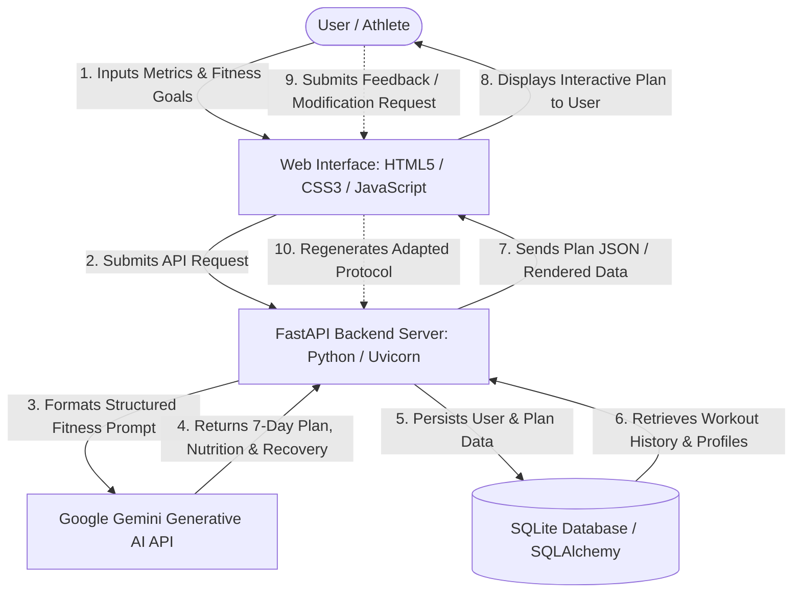

# FitBuddy — AI Fitness Plan Generator using Gemini Models
### Comprehensive Project Documentation Repository

[](#)
[](#)
[](#)
[](#)
[](#)

---

## 📌 Executive Overview

**FitBuddy** is an intelligent, web-based AI fitness planning platform powered by Google Gemini generative models. It addresses the common challenge where users struggle to create and maintain personalized workout routines tailored to their fitness goals, equipment availability, physical metrics, and intensity preferences. 

Through dynamic prompt engineering and intelligent response orchestration, FitBuddy crafts:
- **Personalized 7-Day Workout Blueprints** customized to user fitness goals, experience levels, and workout intensities.
- **Nutrition Targets & Fuel Guidance** including macronutrient ratios, daily caloric recommendations, meal suggestions, and hydration targets.
- **Recovery & Active Rest Advice** including stretching, mobility routines, sleep protocols, and rest-day guidance.
- **Interactive Plan Adaptation & Fine-Tuning** allowing users to submit natural language feedback (e.g., "add more low-impact cardio", "focus on core") to regenerate and adapt their workout protocol.
- **Persistent User History & Administration** tracking generated routines, user profiles, and administrative oversight via an SQLite database.

This repository serves as the official, comprehensive documentation hub tracking the end-to-end software engineering lifecycle of FitBuddy across all 8 standardized project phases.

---

## 👥 Project Team Details

| Attribute | Details |
| :--- | :--- |
| **Team ID** | `SWTID-2026-3464` |
| **Project Name** | FitBuddy – AI Fitness Plan Generator using Gemini Models |
| **Submission Date** | October 2026 |
| **Team Leader** | **Gopinath G** |
| **Team Members** | • **Aravindhundurai R**<br>• **Akash A**<br>• **Navalarasan P**<br>• **Ezhilnithil R** |

---

## 📂 Repository Directory Tree

```
FitBuddy--AI-Fitness-Plan-Generator-using-Gemini-Models-Documents/
│
├── 📄 Readme.md                                      # Master documentation & directory catalog
│
├── 📁 1. Ideation Phase/                             # Concept exploration and user empathy mapping
│   ├── 📄 Brainstorming- Idea Generation- Prioritizaation.pdf
│   ├── 📄 Define Problem Statements.pdf
│   └── 📄 Empathy Map Canvas.pdf
│
├── 📁 2. Requirement Analysis/                       # Functional specifications and tech evaluation
│   ├── 📄 Data Flow Diagrams and User Stories.pdf
│   ├── 📄 Solution Requirements.pdf
│   └── 📄 Technology Stack.pdf
│
├── 📁 3. Project Design Phase/                       # System architecture and solution design
│   ├── 📁 Problem - Solution Fit file/
│   │   └── 📄 Problem - Solution Fit.pdf
│   ├── 📁 Proposed Solution/
│   │   └── 📄 Proposed Solution.pdf
│   └── 📁 Solution Architecture/
│       └── 📄 Solution Architecture.pdf
│
├── 📁 4. Project Planning Phase/                     # Agile Scrum management and sprint planning
│   ├── 📄 Planning Logic.pdf
│   └── 📄 Project Planning.pdf
│
├── 📁 5. Project Development Phase/                  # GenAI execution, testing reports & UAT
│   ├── 📁 Performance Testing/
│   │   └── 📄 GenAI Functional & Performance.pdf
│   └── 📁 User Acceptance Testing/
│       └── 📄 UAT Report.pdf
│
├── 📁 6.Project Testing/                             # Validation benchmarks & test scenario suite
│   └── 📄 Performance Testing.pdf
│
├── 📁 7. Project Documentation/                      # Comprehensive consolidated final report
│   └── 📄 Final Report.pdf
│
└── 📁 8. Project Demonstration/                      # Demonstration assets and presentation space
```

---

## 📑 Detailed Breakdown of Folder Contents

### 1️⃣ Phase 1: Ideation Phase
Focuses on understanding user challenges, establishing design thinking principles, and prioritizing core capabilities.

- **Brainstorming- Idea Generation- Prioritizaation.pdf**
  - Documents creative ideation sessions covering feature categories: *AI Fitness Planning*, *Nutrition & Recovery*, *Progress & Personalization*, *User Engagement*, and *Administration*.
  - Maps ideas along feasibility vs. impact matrices to define MVP requirements.
- **Define Problem Statements.pdf**
  - Identifies core user dilemmas: lack of structured fitness guidance, high cost of personal trainers, rigid generic plans, and lack of dynamic adjustments based on personal feedback.
- **Empathy Map Canvas.pdf**
  - Deep dive into target persona experiences: *Says & Does*, *Thinks & Feels*, *Hears*, *Sees*, *Pain Points* (information overload, injury anxiety, inconsistency), and *Expected Gains* (customized 7-day routine, simple nutrition, actionable feedback loops).

---

### 2️⃣ Phase 2: Requirement Analysis
Translates user needs into technical specifications, flow diagrams, and architectural requirements.

- **Data Flow Diagrams and User Stories.pdf**
  - Defines the flow of data between the user browser, FastAPI web services, Google Gemini AI API endpoints, and SQLite storage.
  - Outlines key user stories (`USN-1` through `USN-7`) with acceptance criteria.
- **Solution Requirements.pdf**
  - **Functional Requirements (FR-1 to FR-6)**: User profile onboarding, 7-day workout plan generation, nutrition & recovery synthesis, feedback-driven routine updates, workout history archives, and admin management.
  - **Non-Functional Requirements (NFR-1 to NFR-6)**: High usability, credential security, robust validation, sub-second to low-latency API handling, server reliability, and vertical/horizontal scalability.
- **Technology Stack.pdf**
  - Detailed evaluation of chosen technologies:
    - **Frontend**: Semantic HTML5, Modern CSS3 (Glassmorphism & responsive layouts), Vanilla JavaScript.
    - **Backend**: Python 3.x, FastAPI, Uvicorn ASGI Server, Jinja2 templating.
    - **AI Services**: Google Gemini API (gemini-1.5-flash / gemini models).
    - **Database**: SQLite3 with SQLAlchemy ORM.

---

### 3️⃣ Phase 3: Project Design Phase
Covers the architectural blueprints, schema layouts, and problem-solution validation.

- **Problem - Solution Fit file / Problem - Solution Fit.pdf**
  - Structured canvas validating customer segments (students, busy professionals, beginners), customer constraints, triggers, existing alternatives, and why FitBuddy provides superior value.
- **Proposed Solution / Proposed Solution.pdf**
  - Comprehensive solution description: interactive user input form, algorithmic prompt constructor, AI streaming/response parser, and feedback iteration mechanism.
- **Solution Architecture / Solution Architecture.pdf**
  - Architectural diagrams illustrating component boundaries, API request/response lifecycles, and database relationship models.

---

### 4️⃣ Phase 4: Project Planning Phase
Outlines the Agile methodology, backlog management, sprint execution, and team velocity metrics.

- **Planning Logic.pdf**
  - Rationale for milestone division, dependency planning between AI prompt engineering and frontend UI components, and risk mitigation strategies.
- **Project Planning.pdf**
  - Product backlog items, story point estimations (Total: 20 Story Points across 2 sprints):
    - **Sprint 1 (13 Story Points)**: Profile inputs, AI prompt generation, nutrition & recovery modules, feedback adaptation.
    - **Sprint 2 (7 Story Points)**: Workout plan history, admin dashboards, database persistence, and optimization.
  - Sprint schedule tracker, sprint velocity ($20 / 2 = 10$ points/sprint), and burndown chart metrics.

---

### 5️⃣ Phase 5: Project Development Phase
Details GenAI functional validation, response formatting tests, and user acceptance evaluations.

- **Performance Testing / GenAI Functional & Performance.pdf**
  - Rigorous verification of Gemini API integration, prompt tuning, token usage efficiency, context retention during plan regeneration, and response consistency under varied input values.
- **User Acceptance Testing / UAT Report.pdf**
  - Real-user acceptance test cases, user feedback on UI responsiveness, clarity of generated workout schedules, readability of nutrition advice, and overall satisfaction scores.

---

### 6️⃣ Phase 6: Project Testing
Systematic functional, load, and integration testing documentation.

- **Performance Testing.pdf**
  - Comprehensive test suite covering test cases `FT-01` to `FT-06` and `PT-01` to `PT-03`:
    - Name and numeric profile input validation
    - Goal and intensity configuration handling
    - End-to-end 7-day routine generation
    - Dynamic plan revision via user feedback
    - Gemini API connection and failure handling
    - Response latency benchmarks and SQLite read/write verification

---

### 7️⃣ Phase 7: Project Documentation
Consolidated master project deliverable.

- **Final Report.pdf**
  - The complete 16-page official project report containing:
    - Executive summary and team attribution
    - Complete design thinking & empathy mapping canvases
    - Requirements matrices (FRs and NFRs)
    - Data flow diagrams (DFD) and system architecture
    - Sprint trackers, velocity calculations, and burndown chart
    - Complete functional & performance test logs with 100% pass rates
    - Full application screenshots (Landing page, input controls, 7-day plan views, nutrition guide, feedback loops, history, and admin panel)
    - In-depth analysis of advantages, constraints, future scope, and health disclaimers

---

### 8️⃣ Phase 8: Project Demonstration
Reserved directory for demonstration assets and deliverables.

- **Folder Path**: `8. Project Demonstration/`
  - Workspace designated for live demo video recordings, project presentation slides (`.pptx`/`.pdf`), and walkthrough documentation for evaluators.

---

## 🏗️ System Architecture & Workflow



---

## 🛠️ Technology Stack Summary

| Layer | Technologies Used | Description |
| :--- | :--- | :--- |
| **Frontend** | HTML5, CSS3, JavaScript | Modern, glassmorphism-styled UI with responsive grid and tabbed schedule trackers |
| **Backend Framework** | Python 3, FastAPI, Uvicorn | High-performance asynchronous REST API handling prompt orchestration and data routing |
| **Generative AI** | Google Gemini Models | Powers intelligent workout generation, recovery insights, and feedback-based adjustments |
| **Database & ORM** | SQLite, SQLAlchemy | Lightweight, persistent storage for user profiles, generated plans, and admin analytics |
| **Templating / UI Sync**| Jinja2 Templates | Dynamic server-side rendering support for rapid data binding |

---

## 📊 Summary Document Matrix

| Phase | Subfolder / Location | Document Name | File Format | Core Focus |
| :---: | :--- | :--- | :---: | :--- |
| **1** | `1. Ideation Phase/` | `Brainstorming- Idea Generation- Prioritizaation.pdf` | PDF | Feature classification and prioritization matrix |
| **1** | `1. Ideation Phase/` | `Define Problem Statements.pdf` | PDF | Formulation of user pain points and problem definitions |
| **1** | `1. Ideation Phase/` | `Empathy Map Canvas.pdf` | PDF | User persona empathy canvas (Think, Feel, Hear, See, Pain, Gain) |
| **2** | `2. Requirement Analysis/` | `Data Flow Diagrams and User Stories.pdf` | PDF | Architectural data flow (DFD) and Agile user stories |
| **2** | `2. Requirement Analysis/` | `Solution Requirements.pdf` | PDF | Detailed Functional (FR) and Non-Functional (NFR) specs |
| **2** | `2. Requirement Analysis/` | `Technology Stack.pdf` | PDF | Rationale and specification for tech stack selection |
| **3** | `3. Project Design Phase/Problem - Solution Fit file/` | `Problem - Solution Fit.pdf` | PDF | Problem-Solution Fit Canvas and market alignment |
| **3** | `3. Project Design Phase/Proposed Solution/` | `Proposed Solution.pdf` | PDF | End-to-end design of the FitBuddy AI solution |
| **3** | `3. Project Design Phase/Solution Architecture/` | `Solution Architecture.pdf` | PDF | Detailed component architecture and API interaction diagrams |
| **4** | `4. Project Planning Phase/` | `Planning Logic.pdf` | PDF | Rationale and timeline planning for implementation |
| **4** | `4. Project Planning Phase/` | `Project Planning.pdf` | PDF | Sprint backlogs, velocity calculation, and burndown chart |
| **5** | `5. Project Development Phase/Performance Testing/` | `GenAI Functional & Performance.pdf` | PDF | AI model verification, token tuning, and functional validation |
| **5** | `5. Project Development Phase/User Acceptance Testing/` | `UAT Report.pdf` | PDF | User acceptance evaluation, feedback logs, and satisfaction |
| **6** | `6.Project Testing/` | `Performance Testing.pdf` | PDF | System-wide test suite logs (`FT-01` to `FT-06`, `PT-01` to `PT-03`) |
| **7** | `7. Project Documentation/` | `Final Report.pdf` | PDF | Complete consolidated 16-page master project report |
| **8** | `8. Project Demonstration/` | *(Directory)* | — | Presentation slides and video demonstration repository |

---

## ⚖️ Disclaimer

> **Wellness Disclaimer**: FitBuddy is designed for educational, informational, and general wellness guidance purposes only. The exercise recommendations and nutritional tips generated by AI are not intended as medical advice, clinical diagnosis, or physical therapy prescriptions. Users should consult certified healthcare and fitness professionals before beginning any rigorous training or dietary regimen.
